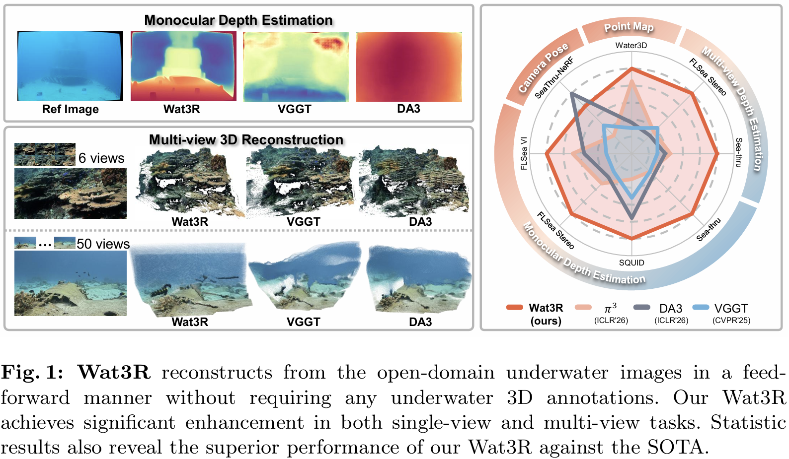
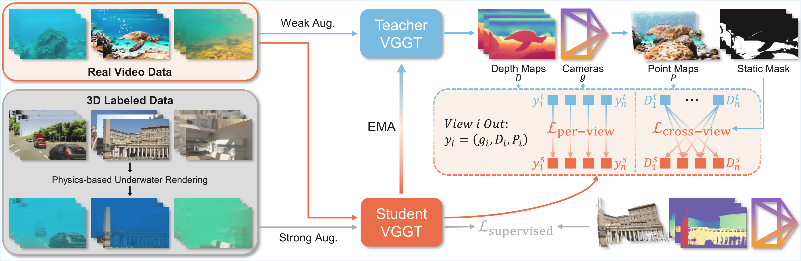
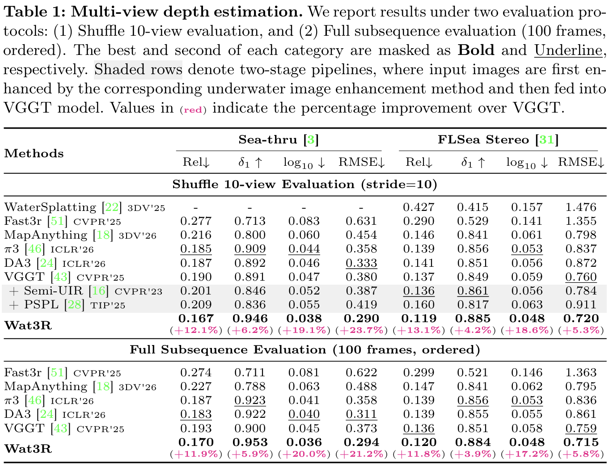
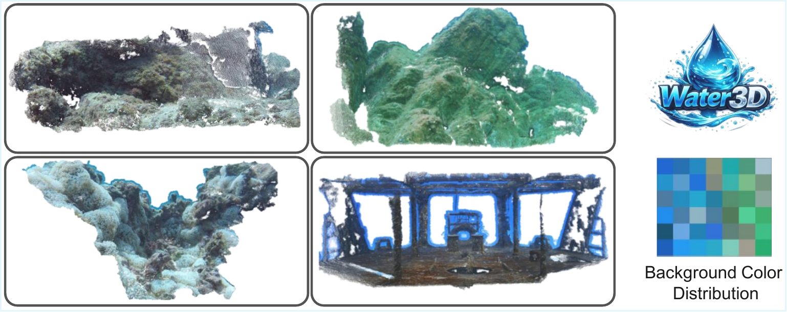

<h1 align="center">
  Wat3R: Underwater 3D Geometry Learning <br>
  without Annotations
</h1>

<div align="center">


[Jiangwei Ren](https://github.com/LSXI7),
[Xingyu Jiang](https://scholar.google.com/citations?user=h2W90MQAAAAJ&hl=en&oi=ao)<sup>†</sup>,
[Zijie Song](https://github.com/Sadak-X),
Wei Xu,
[Hongkai Lin](https://github.com/HongkLin),
[Dingkang Liang](https://dk-liang.github.io/)
and [Xiang Bai](https://scholar.google.com/citations?user=UeltiQ4AAAAJ&hl=en)

Huazhong University of Science & Technology.       
(†) Corresponding author.

</div>


<div align="center">

<a href="https://arxiv.org/abs/2607.08772"></a>
<a href="https://huggingface.co/spaces/lsxi77777/Wat3R"></a>
<a href="https://www.apache.org/licenses/LICENSE-2.0"></a>
<a href="https://openxlab.org.cn/datasets/lsxi7/Water3D"></a>
<a href="https://huggingface.co/datasets/lsxi77777/Water3D"></a>

</div>

<p align="center">
  
</p>

## 📣 News

- **[15/Jul/2026]** [Wat3R Training Code](./training/README.md) is released.
- **[15/Jul/2026]** [Water3D Dataset](https://huggingface.co/datasets/lsxi77777/Water3D) is released.
- **[10/Jul/2026]** Our Wat3R is accepted to ECCV 2026.
- **[10/Jul/2026]** Release the code and checkpoint.

## Abstract

Estimating 3D geometry in underwater environments presents unique challenges due to light attenuation, scattering, and
the absence of large-scale, high-quality 3D annotations. Pioneering methods rely on massive dense annotations that are
impractical in underwater settings. In this paper, we propose **Wat3R**, a cross-domain semi-supervised
learning framework designed to adapt feed-forward 3D reconstruction models from air to underwater scenes. Uniquely, our
method eliminates the need for any annotated underwater data following a teacher-student architecture, that learns
robust geometry representations merely on abundant unlabeled real underwater video footage. We also design a cross-view
consistency loss that leverages geometric cues from other views to compensate for the information degradation in the
current view caused by water attenuation and scattering.
Furthermore, considering the lack of comprehensive evaluation benchmarks, we construct **Water3D**, a
diverse dataset covering various water bodies and underwater scenarios, designed for geometric task evaluation.
Experimental results demonstrate that Wat3R outperforms current state-of-the-art methods in underwater
multi-view depth estimation and point cloud reconstruction.

## Overview

<p align="center">
  
</p>

## Performance

<p align="center">
  
</p>


## Quick Start

### Installation

Run the commands from the Wat3R repository root:

```bash
conda env create -f environment.yaml
conda activate wat3r
pip install -e . --no-deps
```

### Basic Usage

```python
import torch
from wat3r.models.wat3r import Wat3R
from wat3r.utils.load_fn import load_and_preprocess_images
from wat3r.utils.pose_enc import pose_encoding_to_extri_intri

device = torch.device("cuda" if torch.cuda.is_available() else "cpu")
dtype = torch.bfloat16 if device.type == "cuda" and torch.cuda.get_device_capability()[0] >= 8 else torch.float16

# Initialize Wat3R and load the released student checkpoint.
model = Wat3R.from_pretrained("lsxi77777/Wat3R").to(device).eval()

# Load and preprocess example images.
image_names = ["path/to/imageA.png", "path/to/imageB.png", "path/to/imageC.png"]
images = load_and_preprocess_images(image_names, mode="max", target_size=518).to(device)

with torch.no_grad(), torch.cuda.amp.autocast(dtype=dtype, enabled=device.type == "cuda"):
    # Predict cameras, depth maps, and point maps.
    predictions = model(images)

extrinsics, intrinsics = pose_encoding_to_extri_intri(
    predictions["pose_enc"], images.shape[-2:]
)
```

Main outputs:

- `predictions["depth"]`: `[B, S, H, W, 1]`
- `predictions["depth_conf"]`: `[B, S, H, W]`
- `predictions["world_points"]`: `[B, S, H, W, 3]`
- `predictions["world_points_conf"]`: `[B, S, H, W]`
- `extrinsics`: `[B, S, 3, 4]`, OpenCV world-to-camera / cam-from-world `[R|t]`
- `intrinsics`: `[B, S, 3, 3]`, pixel-space camera matrix


### Demo

We provide online demo
<a href="https://huggingface.co/spaces/lsxi77777/Wat3R"></a>,
and local viser demo.

The Viser demo supports static and dynamic visualization.

```bash
python demo_viser.py  --input examples/images  --checkpoint /path/to/wat3r.pt --mode static # or dynamic
```

## Water3D Dataset

We introduce **Water3D**, an underwater 3D dataset covering diverse water bodies and underwater scenes.
It is used in this repository for evaluating underwater depth estimation, camera pose estimation, and point-cloud reconstruction.

The Water3D Dataset is uploaded to [OpenXLab](https://openxlab.org.cn/datasets/lsxi7/Water3D) and [Hugging Face](https://huggingface.co/datasets/lsxi77777/Water3D).

<p align="center">
  
</p>

Each scene should contain the image sequence and COLMAP reconstruction outputs used by the evaluation code:

```text
water3D/
└── <scene>/
    ├── images/
    └── output/
        ├── sparse/
        ├── stereo/depth_maps/
        └── fused.ply
```

## Benchmark Evaluation
See [Evaluation](./evaluation/README.md) for details.

## Training

See [Training](./training/README.md) for details.

## TODO List


- [x] Underwater Evaluation Benchmark
- [x] Online Demo
- [x] Water3D Dataset
- [x] Training Code


## Acknowledgement

We sincerely thank the
[VGGT](https://github.com/facebookresearch/vggt),
[Fast3R](https://github.com/facebookresearch/fast3r) and 
[Marigold](https://github.com/prs-eth/Marigold)
for their open-source code.

## Citation

If you find our work useful in your research, please consider giving a star ⭐ and a citation

```bibtex
@inproceedings{ren2026wat3r,
  title={Wat3R: Underwater 3D Geometry Learning without Annotations},
  author={Ren, Jiangwei and Jiang, Xingyu and Song, Zijie and Xu, Wei and Lin, Hongkai and Liang, Dingkang and Bai, Xiang},
  booktitle={Proceedings of the European Conference on Computer Vision},
  year={2026}
}
```

## License

This repository is under the [Apache-2.0 license](./LICENSE).
